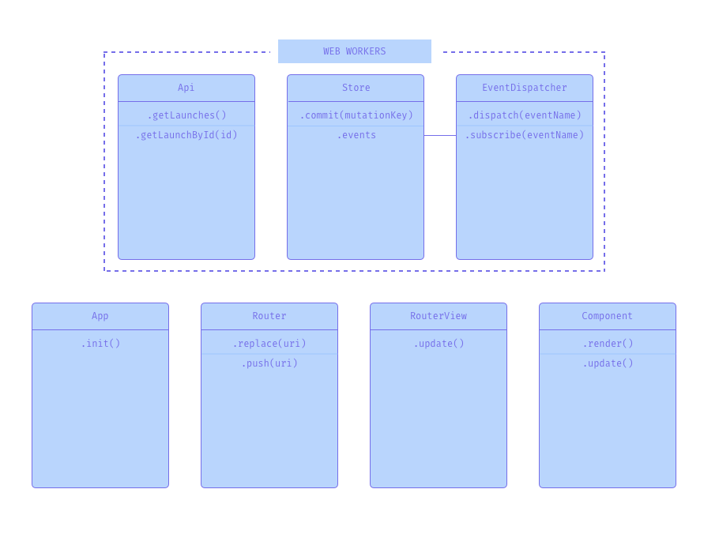
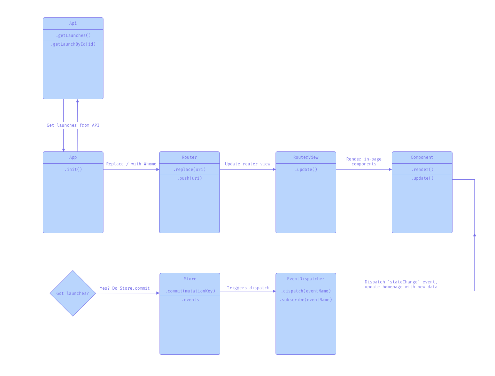

# Launcher

> Launcher shows all SpaceX launches, rockets, pods and dragons from 2006 to now. Users can view details and filter the results


## Installation
```bash
# Clone the repository
git clone https://github.com/kriskuiper/web-app-from-scratch-1920.git

# Install dependencies using yarn or npm
yarn / npm install

# Run a local development environment on port x
yarn dev / npm run dev
```

## Actor diagram


## Interaction diagrams
Below are some interaction diagrams for specific actions in the application.

### Rendering the homepage


## Features
### Overview
An overview of the data a user wants to see, results are paginated and get updated while the user scrolls down.

### Filtering
The user can choose which data they want to see as long if it's one of the following:
- Launches
- Rockets

### Details
User can see details of a specific launch or rocket on a detail page. The detail page consists of a description, some minor details like the launch site and a video of the launch if available.

## API
For this project I used the SpaceX API. You can view the docs [here]().

### Overview
The SpaceX API is an API that shows lots of SpaceX data.

### Endpoints used
The application uses the following endpoints of the SpaceX API:

- `/launches`
	- Shows all launches from SpaceX, results get updated regularly;
- `/launches/:flight_number`
	- Gets specific data for one launch, used to render the detail page with;
- `/rockets`
	- Shows SpaceX launches completely with details.

### API limitations
As far as I know there are no limitations to the API. You can just call the above endpoints and will get data back. Every. Single. Time.

## Project wishlist
- [ ] Make it a Progressive Web App
- [ ] Make the project use it's own virtual DOM
- [ ] Make it server-side rendered

<!-- How about a license here? 📜 (or is it a licence?) 🤷 -->
